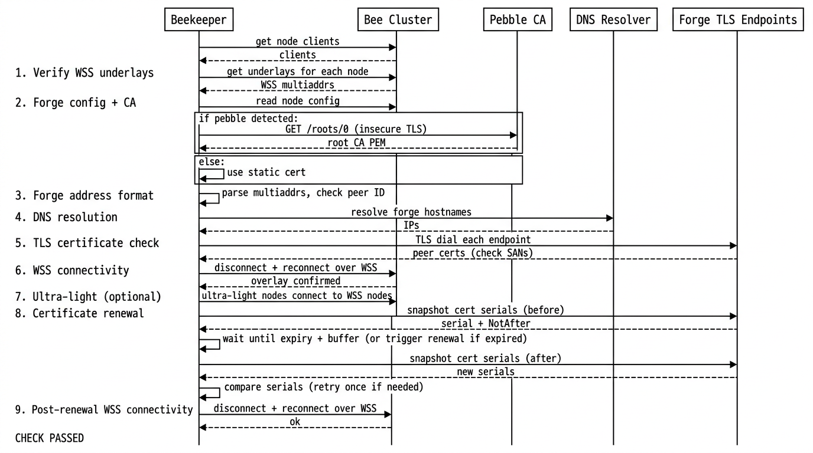

# autotls check

Beekeeper check that validates **p2p-forge** style AutoTLS setup: WSS underlays, forge hostnames, DNS, TLS on forge endpoints, connectivity, and (when possible) **certificate renewal** by comparing cert serials over time.

## What it runs (order)

1. Load API clients for nodes in the configured AutoTLS node groups.
2. **WSS underlays** — confirm nodes expose WebSocket secure underlays (optionally skip a group such as ultra-light).
3. **Forge domain + CA** — read `AutoTLSDomain` (and Pebble CA handling) from the first matching node config.
4. **Forge address format** — parse WSS multiaddrs and check forge hostname / peer id consistency.
5. **DNS** — resolve forge hostnames when `forge-dns-address` is set.
6. **TLS** — dial forge endpoints and verify certificates (SANs, retries for expired certs).
7. **WSS connectivity** — disconnect/reconnect between nodes over WSS underlays.
8. **Ultra-light** (optional) — same connectivity from ultra-light nodes if configured.
9. **Renewal** — snapshot leaf cert serials, wait until near expiry (or trigger dials if already expired), snapshot again, compare serials; then run WSS connectivity again.

If any step fails, the check fails.

## Config (beekeeper)

Check type: `autotls`. Options map to `Options` in `autotls.go`:

| YAML key | Purpose |
|----------|---------|
| `autotls-groups` | Node groups that run AutoTLS (default in code: `bee-autotls`). |
| `ultra-light-group` | Group name for nodes without listen addrs; excluded from WSS underlay collection, used for ultra-light connectivity test. Default: `ultra-light`. Set empty to skip ultra-light tests. |
| `forge-dns-address` | Resolver host:port used to verify DNS resolution of forge hostnames. |
| `forge-tls-host-address` | Optional `host:port` to dial the **first** sorted node’s forge TLS check from this host (e.g. in-cluster DNS). Other nodes still use IP:port from the multiaddr. |
| `pebble-mgmt-url` | Override Pebble **management** URL for fetching the live root CA PEM (see below). |

Defaults: `autotls.NewDefaultOptions()` in `autotls.go`.

## Pebble (local ACME)

When a node’s `AutoTLSCAEndpoint` contains `pebble`, the check fetches the **current** root CA from Pebble’s management API (Pebble rotates its CA on restart). The ACME directory URL in config is turned into a management URL with `pebbleMgmtURL()` (ACME port `14000` → management `15000`, path `/roots/0`). `pebble-mgmt-url` overrides that derived URL.

The HTTP client uses **TLS insecure skip verify** only for that management HTTPS call (self-signed Pebble). Implementation: `internal/service.go` (`Pebble.FetchRootCA`), client wired in `autotls.go`.

## Package layout

| File | Role |
|------|------|
| `autotls.go` | `Check`, `Run`, options, WSS underlay polling, connectivity tests, `forgeConfig`, Pebble URL helper. |
| `forge.go` | Forge multiaddr parsing, DNS/TLS verification helpers, `getCertSnapshots`, `triggerRenewalConnections`, `certSnapshot`. |
| `renewal.go` | Renewal orchestration: wait/compare/retry, `compareCertRenewals` helpers. |
| `internal/service.go` | Small HTTP client wrapper for Pebble management `GET` (root CA PEM). |

Renewal **orchestration** lives in `renewal.go`; TLS dialing and address selection for snapshots and renewal triggers stay in `forge.go` next to other forge TLS code.

## Sequence diagram

